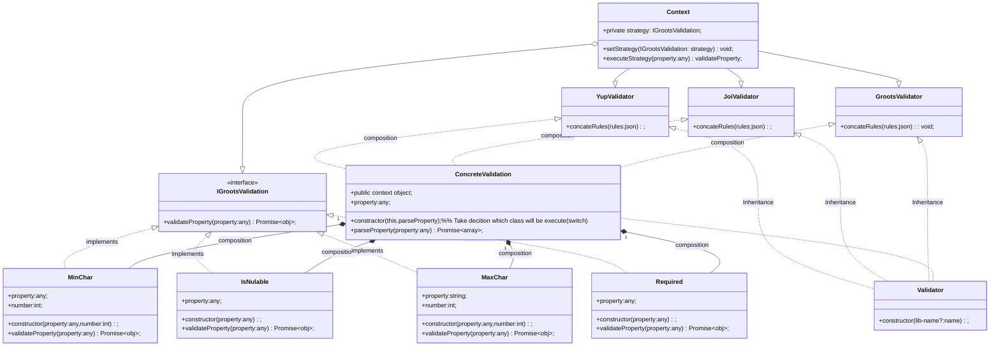

### Client usage

```js
// Call it in app level. & use common validation rules.
const validate = new Validator();
App.use(validate);

// Set customize rules & mapping it with request endpoint
const rules = {
    name: "int|min:100",
    location: "int|min:100",
};
```


