### Client usage

```js
// Call it in app level. & use common validation rules.
//Default call customize validation.
// Otherwise call existing lib joi or yup or e.t.c.
import joi from 'joi';
const validate = new Validator() / new Validator(lib-name?:"joi");
App.use(validate);

// Set customize rules & mapping it with request endpoint
const postJobsRules = {
    name: "int|min:100",
    location: "int|min:100",
};
//Example
const configValidation = {
    POST_JOBS: postJobsRules;
}
```

```mermaid
classDiagram

    class Validator {
        %%Take decition which validator can be use
        %%Default GrootsValidator
        +constructor(lib-name?:name);
    }

    class Context {
        +private strategy: IGrootsValidation;
        +setStrategy(IGrootsValidation: strategy) void;
        +executeStrategy(property:any) validateProperty;
    }

    Context o--|> IGrootsValidation
    class IGrootsValidation{
        <<interface>>
        +validateProperty(property:any) Promise~obj~;
    }

    ConcreteValidation "1" *-- IsNulable : composition
    ConcreteValidation "1" *-- MinChar : composition
    ConcreteValidation "1" *-- MaxChar : composition
    ConcreteValidation "1" *-- Required : composition
    ConcreteValidation --|> Errors : Inheritance
    class ConcreteValidation{
        +public context object;
        +property:any;
        +constractor(this.parseProperty);%% Take decition which class will be execute(switch)
        +parseProperty(property:any) Promise~array~;
    }

    GrootsValidator <|.. Validator : Inheritance
    GrootsValidator <|.. ConcreteValidation : composition
    class GrootsValidator{
        +concateRules(rules:json): void;
        +constructor(concreteValidation: ConcreteValidation);
    }

    JoiValidator <|.. Validator : Inheritance
    JoiValidator <|.. ConcreteValidation : composition
    class JoiValidator{
        +concateRules(rules:json);
        +constructor(concreteValidation: new ConcreteValidation);
    }

    YupValidator <|.. Validator : Inheritance
    YupValidator <|.. ConcreteValidation : composition
    class YupValidator{
        +concateRules(rules:json);
        +constructor(concreteValidation: ConcreteValidation);
    }

    class IErrors{
        +public errors[]:any;
        +getErrors() Promise~array~;
    }

    IErrors <|.. Errors : implements
    class Errors{
        +public errors[]:any;
        +getErrors() Promise~array~;
    }

    IGrootsValidation <|.. MinChar : implements
    IErrors --|> MinChar : composition
    class MinChar {
        +property:any;
        +errors[]:IErrors;
        +number:int;
        +constructor(property:any,number:int, errors:IErrors);
        +validateProperty(property:any, this.errors) Promise~array~;
    }

    IGrootsValidation <|.. MaxChar : implements
    IErrors --|> MaxChar : composition
    class MaxChar {
        +property:string;
        +errors[]:IErrors;
        +number:int;
        +constructor(property:any,number:int, errors:IErrors);
        +validateProperty(property:any, this.errors) Promise~array~;
    }

    IGrootsValidation <|.. Required : implements
    IErrors --|> Required : composition
    class Required {
        +property:any;
        +errors[]:IErrors;
        +constructor(property:any,errors:IErrors);
        +validateProperty(property:any, this.errors) Promise~array~;
    }

    IGrootsValidation <|.. IsNulable : implements
    IErrors --|> IsNulable : composition
    class IsNulable {
        +property:any;
        +errors[]:IErrors;
        +constructor(property:any, this.errors);
        +validateProperty(property:any,errors:IErrors) Promise~array~;
    }




```


