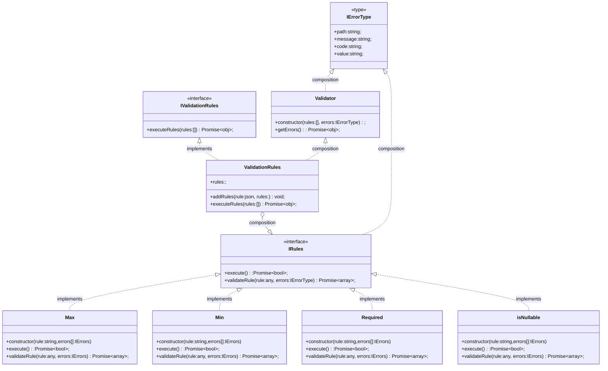

```mermaid
classDiagram

    class IValidationRules{
        <<interface>>
        +executeRules(rules:[]) Promise~obj~;
    }

    IValidationRules <|.. ValidationRules : implements
    Validator <|.. ValidationRules : composition
    ValidationRules o--|> IRules : composition
    class ValidationRules{
        +rules:<rules IRules>;
        +addRules(rule:json, rules:<rules IRules>) void;
         %% executeRules call validator
        +executeRules(rules:[]) Promise~obj~;
    }

    IErrorType <|.. Validator : composition
    class Validator{
        +constructor(rules:[], errors:IErrorType);
        +getErrors(): Promise~obj~;
    }

    class IErrorType{
        <<type>>
        +path:string;
        +message:string;
        +code:string;
        +value:string;
    }

    IErrorType <|.. IRules : composition
    class IRules{
        <<interface>>
        +execute():Promise~bool~;
        +validateRule(rule:any, errors:IErrorType) Promise~array~;
    }

    IRules <|.. Max : implements
    class Max{
        +constructor(rule:string,errors[]:IErrors)
        +execute():Promise~bool~;
        +validateRule(rule:any, errors:IErrors) Promise~array~;
    }

    IRules <|.. Min : implements
    class Min{
        +constructor(rule:string,errors[]:IErrors)
        +execute():Promise~bool~;
        +validateRule(rule:any, errors:IErrors) Promise~array~;
    }

    IRules <|.. Required : implements
    class Required{
        +constructor(rule:string,errors[]:IErrors)
        +execute():Promise~bool~;
        +validateRule(rule:any, errors:IErrors) Promise~array~;
    }

    IRules <|.. isNullable : implements
    class isNullable{
        +constructor(rule:string,errors[]:IErrors)
        +execute():Promise~bool~;
        +validateRule(rule:any, errors:IErrors) Promise~array~;
    }
```
